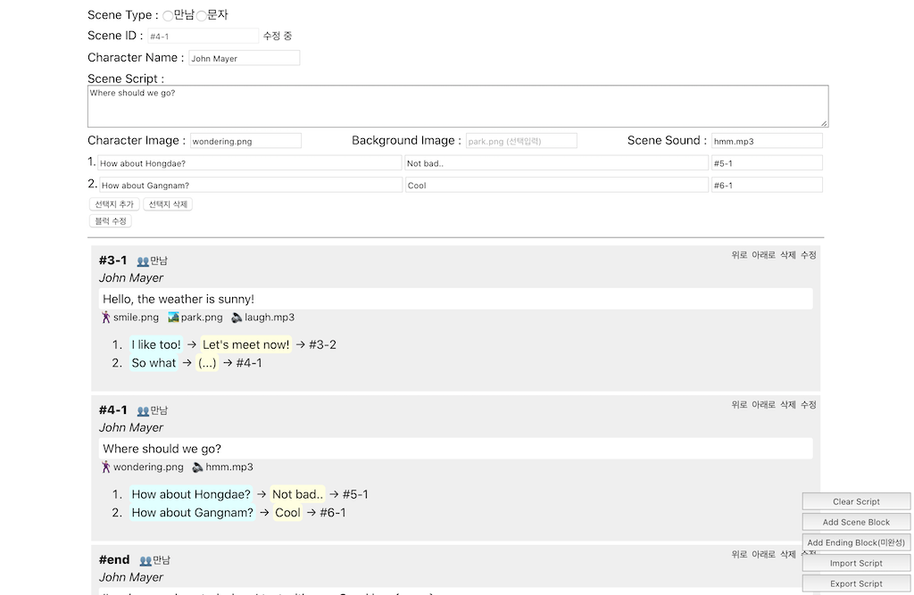

# Choose Your Favorite Character (CYFC)

<blockquote class="instagram-media" data-instgrm-captioned data-instgrm-permalink="https://www.instagram.com/p/CEsyxQFpX6h/?utm_source=ig_embed&amp;utm_campaign=loading" data-instgrm-version="12" style=" background:#FFF; border:0; border-radius:3px; box-shadow:0 0 1px 0 rgba(0,0,0,0.5),0 1px 10px 0 rgba(0,0,0,0.15); margin: 1px; max-width:540px; min-width:326px; padding:0; width:99.375%; width:-webkit-calc(100% - 2px); width:calc(100% - 2px);">
 <a href="https://www.instagram.com/p/CEsyxQFpX6h/?utm_source=ig_embed&amp;utm_campaign=loading" style=" background:#FFFFFF; line-height:0; padding:0 0; text-align:center; text-decoration:none; width:100%;" target="_blank"> 
 

 
 

 

 
<svg width="50px" height="50px" viewBox="0 0 60 60" version="1.1" xmlns="https://www.w3.org/2000/svg" xmlns:xlink="https://www.w3.org/1999/xlink"><g stroke="none" stroke-width="1" fill="none" fill-rule="evenodd"><g transform="translate(-511.000000, -20.000000)" fill="#000000"><g><path d="M556.869,30.41 C554.814,30.41 553.148,32.076 553.148,34.131 C553.148,36.186 554.814,37.852 556.869,37.852 C558.924,37.852 560.59,36.186 560.59,34.131 C560.59,32.076 558.924,30.41 556.869,30.41 M541,60.657 C535.114,60.657 530.342,55.887 530.342,50 C530.342,44.114 535.114,39.342 541,39.342 C546.887,39.342 551.658,44.114 551.658,50 C551.658,55.887 546.887,60.657 541,60.657 M541,33.886 C532.1,33.886 524.886,41.1 524.886,50 C524.886,58.899 532.1,66.113 541,66.113 C549.9,66.113 557.115,58.899 557.115,50 C557.115,41.1 549.9,33.886 541,33.886 M565.378,62.101 C565.244,65.022 564.756,66.606 564.346,67.663 C563.803,69.06 563.154,70.057 562.106,71.106 C561.058,72.155 560.06,72.803 558.662,73.347 C557.607,73.757 556.021,74.244 553.102,74.378 C549.944,74.521 548.997,74.552 541,74.552 C533.003,74.552 532.056,74.521 528.898,74.378 C525.979,74.244 524.393,73.757 523.338,73.347 C521.94,72.803 520.942,72.155 519.894,71.106 C518.846,70.057 518.197,69.06 517.654,67.663 C517.244,66.606 516.755,65.022 516.623,62.101 C516.479,58.943 516.448,57.996 516.448,50 C516.448,42.003 516.479,41.056 516.623,37.899 C516.755,34.978 517.244,33.391 517.654,32.338 C518.197,30.938 518.846,29.942 519.894,28.894 C520.942,27.846 521.94,27.196 523.338,26.654 C524.393,26.244 525.979,25.756 528.898,25.623 C532.057,25.479 533.004,25.448 541,25.448 C548.997,25.448 549.943,25.479 553.102,25.623 C556.021,25.756 557.607,26.244 558.662,26.654 C560.06,27.196 561.058,27.846 562.106,28.894 C563.154,29.942 563.803,30.938 564.346,32.338 C564.756,33.391 565.244,34.978 565.378,37.899 C565.522,41.056 565.552,42.003 565.552,50 C565.552,57.996 565.522,58.943 565.378,62.101 M570.82,37.631 C570.674,34.438 570.167,32.258 569.425,30.349 C568.659,28.377 567.633,26.702 565.965,25.035 C564.297,23.368 562.623,22.342 560.652,21.575 C558.743,20.834 556.562,20.326 553.369,20.18 C550.169,20.033 549.148,20 541,20 C532.853,20 531.831,20.033 528.631,20.18 C525.438,20.326 523.257,20.834 521.349,21.575 C519.376,22.342 517.703,23.368 516.035,25.035 C514.368,26.702 513.342,28.377 512.574,30.349 C511.834,32.258 511.326,34.438 511.181,37.631 C511.035,40.831 511,41.851 511,50 C511,58.147 511.035,59.17 511.181,62.369 C511.326,65.562 511.834,67.743 512.574,69.651 C513.342,71.625 514.368,73.296 516.035,74.965 C517.703,76.634 519.376,77.658 521.349,78.425 C523.257,79.167 525.438,79.673 528.631,79.82 C531.831,79.965 532.853,80.001 541,80.001 C549.148,80.001 550.169,79.965 553.369,79.82 C556.562,79.673 558.743,79.167 560.652,78.425 C562.623,77.658 564.297,76.634 565.965,74.965 C567.633,73.296 568.659,71.625 569.425,69.651 C570.167,67.743 570.674,65.562 570.82,62.369 C570.966,59.17 571,58.147 571,50 C571,41.851 570.966,40.831 570.82,37.631"></path></g></g></g></svg>

 
 View this post on Instagram

 

 

 

 

 

 

 

 

 

</a> 
 <a href="https://www.instagram.com/p/CEsyxQFpX6h/?utm_source=ig_embed&amp;utm_campaign=loading" style=" color:#000; font-family:Arial,sans-serif; font-size:14px; font-style:normal; font-weight:normal; line-height:17px; text-decoration:none; word-wrap:break-word;" target="_blank">안녕!🤗 모두 코로나 조심하면서 잘 지내고 있지? 다섯번째 가명익명 전시 소식을 가져왔어~🥳 전시 제목은 #ChooseYourFavoriteCharacter 👩🏻‍💻 오픈일인 9월 9일에는 작가가 만든 게임 링크도 가삼 인스타 @gasamrojieul 프로필을 통해 공개될거야. 기대많이해주고 계속 건강 조심~ 또 조심! 곧 만나🦹🏻‍♀️🦹🏽 &lt;Choose Your Favorite Character&gt; -가삼 가명익명 기획전 5회- 주최: @gasamrojieul 기획: @gasamrojieul, newcountrykid 참여작가: newcountrykid 포스터 디자인: @woojinnam_ 전시 기간: 9/9-15, 2-8pm 문의: DM #가삼로지을 #gasamrojieul #newcountrykid #가삼가명익명전 #가삼기획전 #현대미술 #게임 #인간관계 #을지로 #힙지로 #전시 #전시회 #미술 #미술전시 #전시공간 #예술공간 #가명 #관객 #소통 #캐릭터 #contemporaryart #exhibition #artexhibition #artspace #gallery #contemporarygallery #game #relationship #character</a>
 
A post shared by <a href="https://www.instagram.com/gasamrojieul/?utm_source=ig_embed&amp;utm_campaign=loading" style=" color:#c9c8cd; font-family:Arial,sans-serif; font-size:14px; font-style:normal; font-weight:normal; line-height:17px;" target="_blank"> 가삼로지을 gasamrojieul</a> (@gasamrojieul) on <time style=" font-family:Arial,sans-serif; font-size:14px; line-height:17px;" datetime="2020-09-04T03:41:16+00:00">Sep 3, 2020 at 8:41pm PDT</time>

</blockquote> 

## 개요

### 배포

https://1000ship.github.io/choose-your-favorite-character-game/

### 제작자

- 노지원
  - 기획
  - 디자인
  - 오디오, 영상 및 인물 이미지 리소스 촬영
- 천성혁
  - 메인게임 개발
  - 스크립트 작성 프로그램 개발

### 제작자 게임의도

>**New Country Kid, \<Choose your favorite character\>, 2020.**
>**Choose your favorite character between Amy, Bella, Clair.**
>**Amy, Bella, Clair 중 당신이 가장 마음에 드는 캐릭터를 선택하십시오.**
>
>인위적으로 만들어진 만남에서는 얼굴, 나이, 출신지, 직업, 학교 등을 통해 단편적으로 상대방을 판단한다. 그 양상은 데이팅 앱에서 눈에 띄게 드러난다. 상대방의 정보를 보고 자신의 기준과 목적에 부합하는지 판단하여 오른쪽, 왼쪽이라는 간단한 행위로 결정을 내린다.
>
>데이팅 앱 사용자는 자신을 유형화시켜 캐릭터를 구축하고, 상대방 또한 하나의 캐릭터로 판단하고 서로의 목적이 부합하다 여기면 만남까지 이르게 된다. 앱을 통해 이루어진 만남은 현실에서의 인간관계와 게임의 중간지점이라 할 수 있다. 현실에서는 자신의 평판과 위치에 영향을 끼치지 않을 정도의 수위를 지키며 행동하지만, 앱을 통해 만들어진 인간관계에서는 자신의 목적을 달성하는 것이 주목표이기에 쉽게 상대에게 무례한 질문을 하거나, 자신의 욕구를 채우기 위한 도구로 전락한다. 게임 스테이지를 깨 듯이 관계를 소비하고, 싫증을 느끼면 차단이라는 쉬운 방법으로 관계를 끊고 다른 사람과 같은 행동을 반복하거나 앱을 삭제한다.
>
>\<Choose Your Favorite Character\>를 통해 휘발성을 띠는 인간관계에서 나타나는 태도와 현상에 관해 이야기하고자 한다. 작가는 일회적으로 공략해야 하는 캐릭터 혹은 스테이지로 관계를 소비하는 현상을 보고 이에 연애 시뮬레이션 게임 형식을 도입하여 관객이 길티 플레저를 느끼도록 유도한다. 게임이라는 매체를 통해 관객은 죄의식을 느끼지 않고 무례하게 행동할 수 있게 되지만, 캐릭터 또한 선택적으로 자신을 드러내거나 태도를 바꾼다. 게임을 하는 동안 관객의 목표는 캐릭터 공략이지만, 게임이 완전히 끝난 뒤 이 관계가 자신에게 큰 타격을 주지 않는 것과 자신도 캐릭터로서 소비되었다는 것을 깨닫는다. 자신의 선택으로 만들어진 유사 연애와 이별을 경험함으로써 서로를 게임처럼 소비하고 쉽게 잊히는 허무한 인간관계를 보여준다.

## 게임 스크린샷

|      |             |
| ------------------------------------------------- | :----------------------------------------------------------: |
|  |  |

## 관련 프로젝트

### 대본형식 게임을 만들기 위한 자체 개발 툴, game-script-tool 

- GitHub Repository (https://github.com/1000ship/game-script-tool)
- 개발자가 기획자에게 제공한 대본 편집 툴
- JSON 형태의 데이터로 Import/Export하여 게임 대본 제작 시 활용