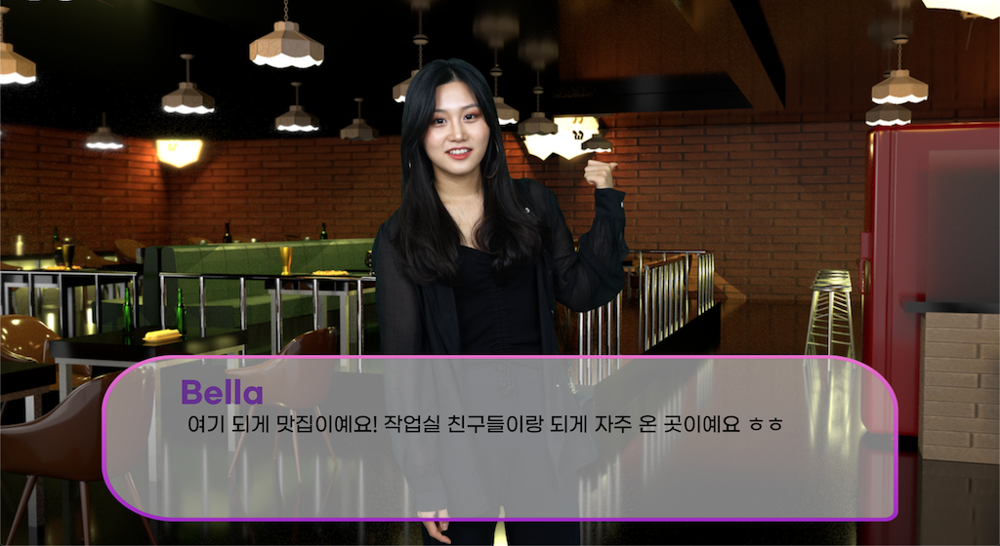
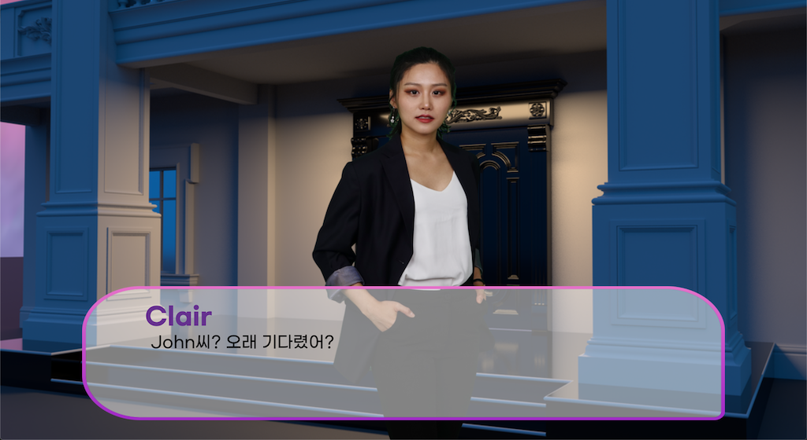

게임 실행주소 : https://1000ship.github.io/choose-your-favorite-character-game/

## 목차

* [개요](#summary)
  * [전시](#exhibition)
  * [제작자](#maker)
  * [게임설명](#game-description)
* [게임 스크린샷](#screenshots)
* [관련 프로젝트](#relative-project)

## 개요 

### 전시 

  

- 주최: @gasamrojieul 
- 기획: @gasamrojieul, newcountrykid
- 참여작가: newcountrykid 
- 전시기간: 2020. 09. 09. ~ 2020. 09. 15, 2~8pm

### 제작자 

- 노지원
  - 기획
  - 디자인
  - 오디오, 영상 및 인물 이미지 리소스 촬영
- 천성혁
  - 메인게임 개발
  - 스크립트 작성 프로그램 개발

### 게임설명 

>**New Country Kid, \<Choose your favorite character\>, 2020.**
>**Choose your favorite character between Amy, Bella, Clair.**
>**Amy, Bella, Clair 중 당신이 가장 마음에 드는 캐릭터를 선택하십시오.**
>
>인위적으로 만들어진 만남에서는 얼굴, 나이, 출신지, 직업, 학교 등을 통해 단편적으로 상대방을 판단한다. 그 양상은 데이팅 앱에서 눈에 띄게 드러난다. 상대방의 정보를 보고 자신의 기준과 목적에 부합하는지 판단하여 오른쪽, 왼쪽이라는 간단한 행위로 결정을 내린다.
>
>데이팅 앱 사용자는 자신을 유형화시켜 캐릭터를 구축하고, 상대방 또한 하나의 캐릭터로 판단하고 서로의 목적이 부합하다 여기면 만남까지 이르게 된다. 앱을 통해 이루어진 만남은 현실에서의 인간관계와 게임의 중간지점이라 할 수 있다. 현실에서는 자신의 평판과 위치에 영향을 끼치지 않을 정도의 수위를 지키며 행동하지만, 앱을 통해 만들어진 인간관계에서는 자신의 목적을 달성하는 것이 주목표이기에 쉽게 상대에게 무례한 질문을 하거나, 자신의 욕구를 채우기 위한 도구로 전락한다. 게임 스테이지를 깨 듯이 관계를 소비하고, 싫증을 느끼면 차단이라는 쉬운 방법으로 관계를 끊고 다른 사람과 같은 행동을 반복하거나 앱을 삭제한다.
>
>\<Choose Your Favorite Character\>를 통해 휘발성을 띠는 인간관계에서 나타나는 태도와 현상에 관해 이야기하고자 한다. 작가는 일회적으로 공략해야 하는 캐릭터 혹은 스테이지로 관계를 소비하는 현상을 보고 이에 연애 시뮬레이션 게임 형식을 도입하여 관객이 길티 플레저를 느끼도록 유도한다. 게임이라는 매체를 통해 관객은 죄의식을 느끼지 않고 무례하게 행동할 수 있게 되지만, 캐릭터 또한 선택적으로 자신을 드러내거나 태도를 바꾼다. 게임을 하는 동안 관객의 목표는 캐릭터 공략이지만, 게임이 완전히 끝난 뒤 이 관계가 자신에게 큰 타격을 주지 않는 것과 자신도 캐릭터로서 소비되었다는 것을 깨닫는다. 자신의 선택으로 만들어진 유사 연애와 이별을 경험함으로써 서로를 게임처럼 소비하고 쉽게 잊히는 허무한 인간관계를 보여준다.

## 게임 스크린샷 

|      |             |
| :--: | :--: |
|  |  |

## 관련 프로젝트 

### 대본형식 게임을 만들기 위한 자체 개발 툴, 🛠game-script-tool 

- GitHub Repository (https://github.com/1000ship/game-script-tool)
- 개발자가 기획자에게 제공한 대본 편집 툴
- JSON 형태의 데이터로 Import/Export하여 게임 대본 제작 시 활용